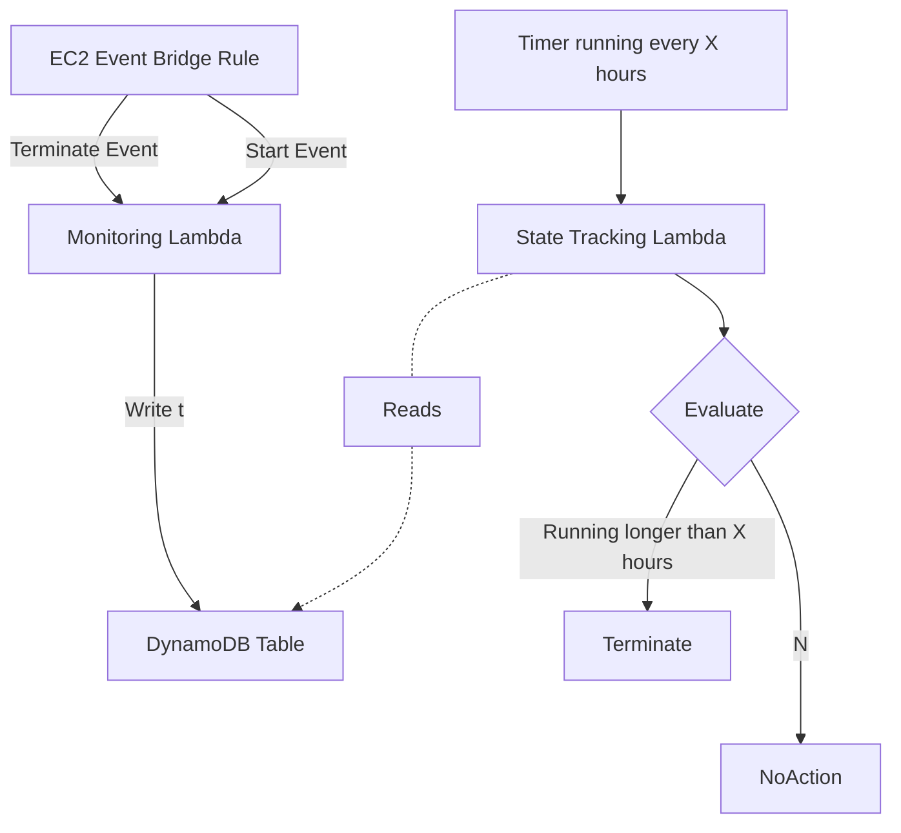

```mermaid
graph TD;
    EBR[EC2 Event Bridge Rule]--Terminate Event--> MLambda[Monitoring Lambda]
    EBR--Start Event--> MLambda
    MLambda --Write to--> DYN[DynamoDB Table] 
    Timer[Timer running every X hours] --> SLambda[State Tracking Lambda]
    SLambda-.-Reads-.->DYN
    SLambda-->Eval{Evaluate}
    Eval--Running longer than X hours-->Terminate
    Eval--No-->NoAction
```